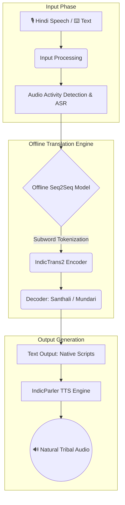
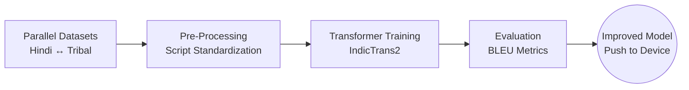

# 🌿 SANKALP SAMVAAD
### Offline AI Voice Bridge for Tribal Classrooms
  
**Smart India Hackathon 2026** | **Problem Statement ID: 26042**
  
*Government of Jharkhand • Department of Higher & Technical Education • Smart Education*

*Inclusive Education • Stronger Communities*

---

## 🎯 The Problem

Jharkhand's **PALASH Mother Tongue-Based Multilingual Education (MTB-MLE)** programme is bottlenecked by a severe shortage of teachers proficient in tribal languages (Ho, Mundari, Santhali). Most primary school teachers in tribal areas are Hindi-medium trained and lack the linguistic tools to deliver mother-tongue-based instruction. 

**The Goal:** Develop an AI-assisted translation suite enabling non-native teachers to deliver mother-tongue-based instruction. It must feature real-time voice translation (sub-3-second latency), offline capability on low-end Android tablets (2GB RAM), and bilingual curriculum generation.

---

## 💡 Our Solution: SAMVAAD

**SAMVAAD** is a fully offline, AI-powered application designed to bridge the language gap in tribal classrooms. It allows Hindi-speaking teachers to communicate interactively with students in their mother tongues, ensuring the pedagogical intent of the MTB-MLE programme is realized at scale.

### ✨ Where SAMVAAD Stands Today
| Language | Status | Capabilities |
| :--- | :--- | :--- |
| **Santhali (Ol Chiki)** | ✅ Supported | Full Translation + Speech Synthesis (TTS) |
| **Mundari (Devanagari)**| ✅ Supported | Full Translation + Speech Synthesis (TTS) |
| **Ho (Warang Citi)** | ⏳ Pipeline Ready | Architecture complete, aggregating parallel data |
| **Kurukh & Kharia** | 📅 Planned | Scheduled for future scaling |

**Core Highlights:**
*   🚀 **Fully Offline:** Runs flawlessly on 2GB RAM Android tablets without internet.
*   ⚡ **Ultra-Low Latency:** Sub-3-second real-time voice translation.
*   📚 **Foundational FLN Content:** Targeted at bridging initial classroom interactions.

---

## 🏗️ App Architecture & Processing Pipeline

### 1. Translation Flow Architecture
SAMVAAD is designed for seamless classroom interactions directly on an Android Tablet. 

### 2. Dataset & Fine-Tuning Pipeline
Our translation models continuously improve through a robust pipeline:

---

## 🚀 How to Run

Testing SAMVAAD is incredibly simple. You do not need to compile code, set up environments, or require an internet connection.

1. Locate the **`Samvaad.apk`** file inside the `Samvaad_APK` folder.
2. Transfer it to any Android Tablet or Smartphone (Android 9+, minimum 2GB RAM).
3. **Install** the APK.
4. **Open the app** and start speaking in Hindi! The app works 100% offline right out of the box.

---

## 🗺️ Roadmap & Future Priorities

From a translation prototype to a complete teaching and learning platform:

| Phase | Priority | Description |
| :---: | :--- | :--- |
| **1** | **Expand Curriculum Coverage** | Scale from foundational FLN (Class 1-3) to full NIPUN Bharat syllabus support (up to Class 12). |
| **2** | **AI Teacher Assistant** | Move beyond translation to generating original teaching material, lesson plans, bilingual worksheets, and visual flashcards. |
| **3** | **Extend Language Support** | Complete the 5-language footprint of PALASH by adding **Kurukh** and **Kharia**. |
| **4** | **Community Feedback Loop** | Empower teachers to contribute verified sentence pairs directly on the device, ensuring translations continuously improve. |

 

  <i>A complete, offline, multilingual teaching and learning platform for all 5 tribal languages under PALASH — built with and for the community.</i>

