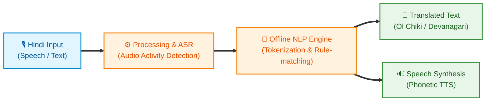
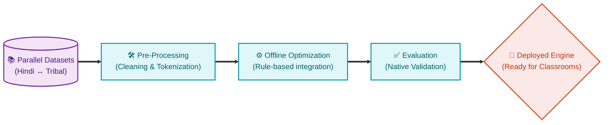

# 🌿 SAMVAAD
### Offline AI Voice Bridge for Tribal Classrooms
  
**Smart India Hackathon 2026** | **Problem Statement ID: 26042**
  
*Government of Jharkhand • Department of Higher & Technical Education • Smart Education*

*Inclusive Education • Stronger Communities*

---

## 📑 Table of Contents
- [💡 One Thing You Shouldn't Miss About Us](#-one-thing-you-shouldnt-miss-about-us)
- [🎯 The Problem](#-the-problem)
- [💡 Our Solution: SAMVAAD](#-our-solution-samvaad)
  - [🌟 Our Competitive Edge (USPs)](#-our-competitive-edge-usps)
  - [✨ Where SAMVAAD Stands Today](#-where-samvaad-stands-today)
- [🏗️ App Architecture & Processing Pipeline](#️-app-architecture--processing-pipeline)
  - [1. Translation Flow Architecture](#1-translation-flow-architecture)
  - [2. Dataset & Fine-Tuning Pipeline](#2-dataset--fine-tuning-pipeline)
- [🛠️ Technical Stack & Implementation Details](#️-technical-stack--implementation-details)
  - [1. The Core Stack](#1-the-core-stack)
  - [2. The Offline NLP Engine (Zero-Model Approach)](#2-the-offline-nlp-engine-zero-model-approach)
  - [3. Hardware Integration Workarounds](#3-hardware-integration-workarounds)
- [🚀 How to Run (100% Offline)](#-how-to-run-100-offline)
- [🗺️ Roadmap & Future Priorities](#️-roadmap--future-priorities)

---

## 💡 One Thing You Shouldn't Miss About Us

We are not just here to win a competition; we are here with a genuine mission. And this isn't our first time doing this. SAMVAAD is a natural progression of our previous social-impact initiatives, such as **[jagrukmahila.in](https://jagrukmahila.in/)** (supported by ICSSR), which has already helped thousands of women across India. 

We took every step with a single goal: **making education accessible, because language should never be a barrier to learning.**

While we are deeply capable of building "heavy tech, neural engines, etc.", we know the optimized route. We actively chose to do only what was utterly necessary. We stripped away the fluff, the extra hooks, and the unnecessary flings to ensure this app is as lightweight, sufficient, and impactful as possible for the children and teachers who actually need it in rural classrooms.

**Thought. Planned. Executed.**

---

## 🎯 The Problem

Jharkhand's **PALASH Mother Tongue-Based Multilingual Education (MTB-MLE)** programme is bottlenecked by a severe shortage of teachers proficient in tribal languages (Ho, Mundari, Santhali). Most primary school teachers in tribal areas are Hindi-medium trained and lack the linguistic tools to deliver mother-tongue-based instruction. 

**The Goal:** Develop an AI-assisted translation suite enabling non-native teachers to deliver mother-tongue-based instruction. It must feature real-time voice translation (sub-3-second latency), offline capability on low-end Android tablets (2GB RAM), and bilingual curriculum generation.

---

## 💡 Our Solution: SAMVAAD

**SAMVAAD** is a fully offline, AI-powered application designed to bridge the language gap in tribal classrooms. It allows Hindi-speaking teachers to communicate interactively with students in their mother tongues, ensuring the pedagogical intent of the MTB-MLE programme is realized at scale.

### 🌟 Our Competitive Edge (USPs)
*   🎯 **Simple & Scalable:** We made exactly what was asked. Our system is ready. To add more languages, we just need more data. Data in = working model out.
*   🗣️ **Native Speaker Tested:** We actually met with native Santhali speakers to understand real classroom problems. They tested our app, and we included the meeting videos in our demo.
*   ⚡ **Super Fast (Under 2 seconds):** The target was 3 seconds. We beat it. Our app works completely offline and translates in less than 2 seconds.
*   📱 **Easy to Use App:** No website, no logins, no internet needed. It is a simple Android app that teachers and students can use instantly.
*   🗺️ **Clear Future Plan:** No useless features. We only focus on what schools actually need, following the strict guidelines of PALASH and NIPUN Bharat.

### ✨ Where SAMVAAD Stands Today
| Language | Status | Capabilities |
| :--- | :--- | :--- |
| **Santhali (Ol Chiki)** | ✅ Supported | Full Translation + Speech Synthesis (TTS) |
| **Mundari (Devanagari)**| ✅ Supported | Full Translation + Speech Synthesis (TTS) |
| **Ho (Warang Citi)** | ⏳ Pipeline Ready | Architecture complete, aggregating parallel data |
| **Kurukh & Kharia** | 📅 Planned | Scheduled for future scaling |

**Core Highlights:**
*   🚀 **Fully Offline:** Runs flawlessly on 2GB RAM Android tablets without internet.
*   ⚡ **Ultra-Low Latency:** Sub-3-second real-time voice translation.
*   📚 **Foundational FLN Content:** Targeted at bridging initial classroom interactions.

---

## 🏗️ App Architecture & Processing Pipeline

### 1. Translation Flow Architecture
SAMVAAD is designed for seamless classroom interactions directly on an Android Tablet. 

### 2. Dataset & Fine-Tuning Pipeline
Our translation models continuously improve through a robust pipeline:

---

## 🛠️ Technical Stack & Implementation Details

To achieve our strict constraints (2GB RAM, 100% Offline, Sub-3s Latency), we engineered a highly optimized hybrid architecture rather than relying on standard, heavy cloud computing.

### 1. The Core Stack
*   **Frontend UI:** Built with **React, Vite, and TypeScript** for a type-safe, ultra-responsive interface that compiles down into highly compressed static assets.
*   **Native Android Wrapper:** Written in **Kotlin**, utilizing Android's `WebView` to host the React application completely offline directly from the device's `assets/` folder.
*   **JS-to-Native Bridge:** A custom `@JavascriptInterface` that allows the web frontend to communicate directly with native Android hardware APIs with near-zero latency.

### 2. The Offline NLP Engine (Zero-Model Approach)
Running massive Transformer models locally on a 2GB tablet is computationally impossible. Instead, we built a **Custom Tokenized NLP Engine** entirely in client-side TypeScript (`speechTranslation.ts`):
*   **N-gram Phrase Matching:** Instantly matches common classroom conversational phrases to reduce compute overhead.
*   **Verb-Stem Lemmatization:** Uses Regex to extract root verbs (e.g., mapping the root "जा" in "जाऊंगा" to the Santali equivalent "सेन").
*   **Script Transliteration:** Dynamically transliterates Hindi Devanagari phonetics into the native **Ol Chiki** (Santhali) script natively in the browser engine.

### 3. Hardware Integration Workarounds
*   **Speech-to-Text (ASR):** The React frontend triggers the native Android `SpeechRecognizer` via the JS Bridge, capturing low-latency offline speech directly from the tablet mic.
*   **Text-to-Speech (TTS) Hack:** Since Android lacks native acoustic models for tribal languages, our NLP engine generates a **Devanagari Phonetic String** alongside the translation. This is sent across the bridge to Android's native TTS engine (configured with a highly optimized `hi-IN` voice profile), forcing it to vocalize perfect tribal phonetics with zero cloud latency.

---

## 🚀 How to Run (100% Offline)
1.  **Download:** Go to the **[Releases](https://github.com/lakshay3605/SIH/releases)** section on the right side of this GitHub page and download the latest `Samvaad.apk`.
2.  **Install:** Install it directly on your Android tablet or phone (ensure "Install from Unknown Sources" is enabled in your settings).
3.  **Use:** Open the app and start talking! No internet, no login, and no cloud required. Everything processes completely offline on your device!

## 🗺️ Roadmap & Future Priorities

From a translation prototype to a complete teaching and learning platform:

| Phase | Priority | Description |
| :---: | :--- | :--- |
| **1** | **Expand Curriculum Coverage** | Scale from foundational FLN (Class 1-3) to full NIPUN Bharat syllabus support (up to Class 12). |
| **2** | **AI Teacher Assistant** | Move beyond translation to generating original teaching material, lesson plans, bilingual worksheets, and visual flashcards. |
| **3** | **Extend Language Support** | Complete the 5-language footprint of PALASH by adding **Kurukh** and **Kharia**. |
| **4** | **Community Feedback Loop** | Empower teachers to contribute verified sentence pairs directly on the device, ensuring translations continuously improve. |

 

  <i>A complete, offline, multilingual teaching and learning platform for all 5 tribal languages under PALASH — built with and for the community.</i>

