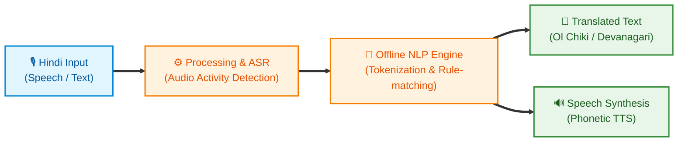
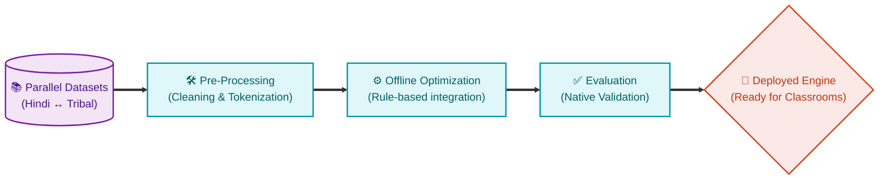

# 🌿 SANKALP SAMVAAD
### Offline AI Voice Bridge for Tribal Classrooms
  
**Smart India Hackathon 2026** | **Problem Statement ID: 26042**
  
*Government of Jharkhand • Department of Higher & Technical Education • Smart Education*

*Inclusive Education • Stronger Communities*

---

## 📑 Table of Contents

- [🎯 The Problem](#-the-problem)
 

- [💡 Our Solution: SAMVAAD](#-our-solution-samvaad)
  - [🌟 Our Competitive Edge (USPs)](#-our-competitive-edge-usps)
  - [✨ Where SAMVAAD Stands Today](#-where-samvaad-stands-today)
 

- [🏗️ App Architecture & Processing Pipeline](#️-app-architecture--processing-pipeline)
  - [1. Translation Flow Architecture](#1-translation-flow-architecture)
  - [2. Dataset & Fine-Tuning Pipeline](#2-dataset--fine-tuning-pipeline)
 

- [🚀 How to Run (100% Offline)](#-how-to-run-100-offline)
 

- [🗺️ Roadmap & Future Priorities](#️-roadmap--future-priorities)

---

## 🎯 The Problem

Jharkhand's **PALASH Mother Tongue-Based Multilingual Education (MTB-MLE)** programme is bottlenecked by a severe shortage of teachers proficient in tribal languages (Ho, Mundari, Santhali). Most primary school teachers in tribal areas are Hindi-medium trained and lack the linguistic tools to deliver mother-tongue-based instruction. 

**The Goal:** Develop an AI-assisted translation suite enabling non-native teachers to deliver mother-tongue-based instruction. It must feature real-time voice translation (sub-3-second latency), offline capability on low-end Android tablets (2GB RAM), and bilingual curriculum generation.

---

## 💡 Our Solution: SAMVAAD

**SAMVAAD** is a fully offline, AI-powered application designed to bridge the language gap in tribal classrooms. It allows Hindi-speaking teachers to communicate interactively with students in their mother tongues, ensuring the pedagogical intent of the MTB-MLE programme is realized at scale.

### 🌟 Our Competitive Edge (USPs)
Why SAMVAAD is the most viable and realistic solution for rural deployment:
*   🎯 **Honest & Highly Scalable Pipeline:** No exaggerated AI claims. We built exactly what we promised using a highly generalized pipeline. Scaling to the remaining tribal languages is now simply a matter of data input—feed the parallel data in, get a furnished model out.
*   🗣️ **Ground-Truth Research & Native Validation:** We didn't just assume classroom conditions from afar. We conducted validation meetings with native Santhali speakers to uncover the *real* on-ground truth about these rural schools and their unique challenges. This ensures our app is not just linguistically accurate, but practically viable for real teachers (recordings included in our demo video).
*   ⚡ **Blazing Fast (Sub-2s Latency):** We comfortably beat the 3-second target. Our translations process 100% offline in under 2 seconds, ensuring natural, uninterrupted classroom dialogue.
*   📱 **Frictionless Native App:** No websites, no web pages, no online logins, and no cloud databases. We delivered a lightweight, dead-simple Android application perfectly suited for both teachers and students.
*   🗺️ **Pragmatic, Focused Roadmap:** Our future scope is strictly aligned with the PALASH and NIPUN Bharat frameworks. No unnecessary add-ons or bloat—just planned, structured steps to scale into a complete educational platform.

### ✨ Where SAMVAAD Stands Today
| Language | Status | Capabilities |
| :--- | :--- | :--- |
| **Santhali (Ol Chiki)** | ✅ Supported | Full Translation + Speech Synthesis (TTS) |
| **Mundari (Devanagari)**| ✅ Supported | Full Translation + Speech Synthesis (TTS) |
| **Ho (Warang Citi)** | ⏳ Pipeline Ready | Architecture complete, aggregating parallel data |
| **Kurukh & Kharia** | 📅 Planned | Scheduled for future scaling |

**Core Highlights:**
*   🚀 **Fully Offline:** Runs flawlessly on 2GB RAM Android tablets without internet.
*   ⚡ **Ultra-Low Latency:** Sub-3-second real-time voice translation.
*   📚 **Foundational FLN Content:** Targeted at bridging initial classroom interactions.

---

## 🏗️ App Architecture & Processing Pipeline

### 1. Translation Flow Architecture
SAMVAAD is designed for seamless classroom interactions directly on an Android Tablet. 

### 2. Dataset & Fine-Tuning Pipeline
Our translation models continuously improve through a robust pipeline:

---

## 🚀 How to Run (100% Offline)

1. Get **`Samvaad.apk`** from the `Samvaad_APK` folder.
2. Install on any Android device (9+, min 2GB RAM).
3. Open and start speaking! No internet required.

---

## 🗺️ Roadmap & Future Priorities

From a translation prototype to a complete teaching and learning platform:

| Phase | Priority | Description |
| :---: | :--- | :--- |
| **1** | **Expand Curriculum Coverage** | Scale from foundational FLN (Class 1-3) to full NIPUN Bharat syllabus support (up to Class 12). |
| **2** | **AI Teacher Assistant** | Move beyond translation to generating original teaching material, lesson plans, bilingual worksheets, and visual flashcards. |
| **3** | **Extend Language Support** | Complete the 5-language footprint of PALASH by adding **Kurukh** and **Kharia**. |
| **4** | **Community Feedback Loop** | Empower teachers to contribute verified sentence pairs directly on the device, ensuring translations continuously improve. |

 

  <i>A complete, offline, multilingual teaching and learning platform for all 5 tribal languages under PALASH — built with and for the community.</i>

