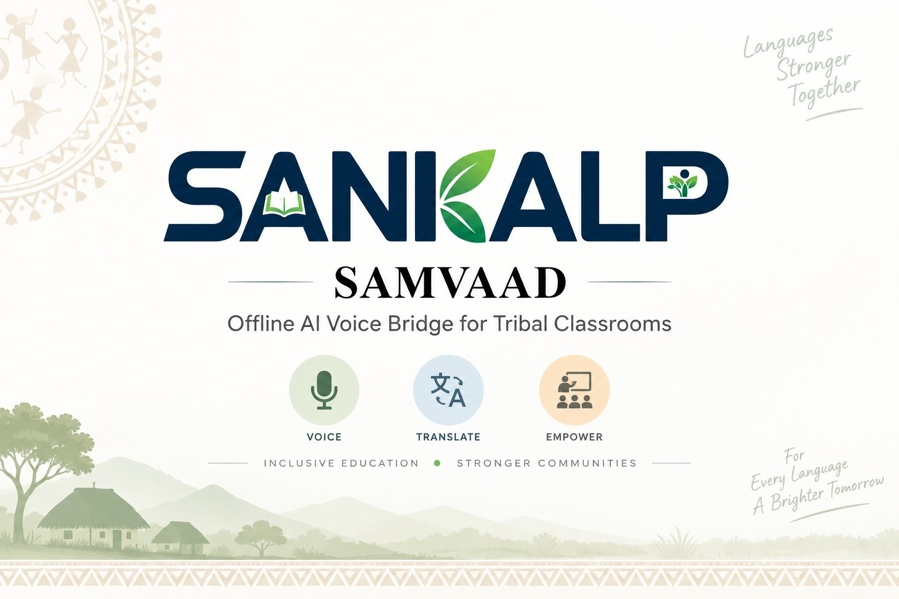
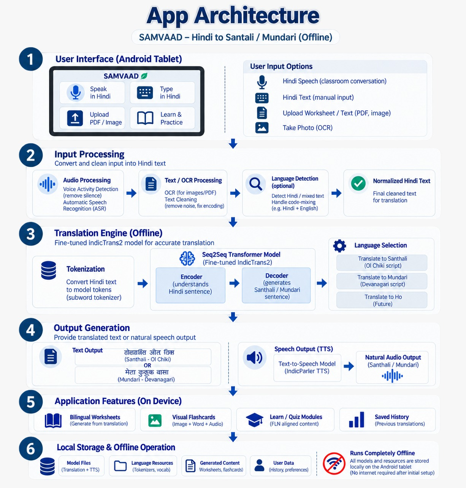
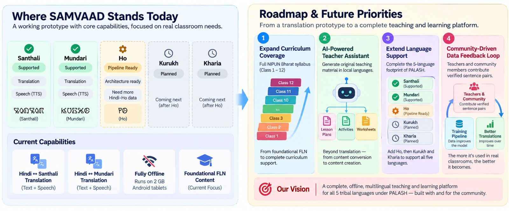

  

  # SANKALP SAMVAAD
  ### Offline AI Voice Bridge for Tribal Classrooms
  
  **Smart India Hackathon 2026** | **Problem Statement ID: 26042**
  
  *Government of Jharkhand • Department of Higher & Technical Education • Smart Education*

---

## 🎯 The Problem

Jharkhand's PALASH Mother Tongue-Based Multilingual Education (MTB-MLE) programme is bottlenecked by a shortage of teachers proficient in tribal languages (Ho, Mundari, Santhali). Most primary school teachers in tribal areas are Hindi-medium trained and lack the linguistic tools to deliver mother-tongue-based instruction. Without a technology bridge, children in over 5,000 tribal-area primary schools struggle to comprehend instructions.

**The Goal:** Develop an AI-assisted translation suite enabling non-native teachers to deliver mother-tongue-based instruction. It must feature real-time voice translation (sub-3-second latency), offline capability on low-end Android tablets (2GB RAM), and bilingual curriculum generation.

---

## 💡 Our Solution: SAMVAAD

**SAMVAAD** is a fully offline, AI-powered application designed to bridge the language gap in tribal classrooms. It allows Hindi-speaking teachers to communicate interactively with students in their mother tongues, ensuring the pedagogical intent of the MTB-MLE programme is realized at scale.

### ✨ Where SAMVAAD Stands Today
*   ✅ **Santhali:** Supported (Translation + Speech TTS)
*   ✅ **Mundari:** Supported (Translation + Speech TTS)
*   ⏳ **Ho:** Pipeline Ready (Architecture ready, gathering Hindi-Ho data)
*   🚀 **Fully Offline:** Runs flawlessly on 2GB RAM Android tablets without internet.
*   📚 **Foundational FLN Content:** Targeted at bridging initial classroom interactions.

---

## 🏗️ Architecture & Pipeline

  

### 1. App Architecture
SAMVAAD is designed for seamless classroom interactions directly on an Android Tablet:
*   **User Input:** Voice Activity Detection (ASR), Text Input, or Worksheet Upload (OCR).
*   **Translation Engine (Offline):** A fine-tuned Seq2Seq Transformer Model (IndicTrans2) running locally.
*   **Output Generation:** Generates native scripts (Ol Chiki for Santhali, Devanagari for Mundari) and natural Audio Output via IndicParler TTS.
*   **On-Device Features:** Auto-generates bilingual worksheets, visual flashcards, and quiz modules aligned to the NIPUN Bharat framework.

### 2. Dataset & Fine-Tuning Pipeline
Our translation models continuously improve through a robust pipeline:
*   **Parallel Datasets:** Aggregating Hindi ↔ Santhali/Mundari sentence pairs.
*   **Pre-Processing:** Script standardization to Ol Chiki, subword tokenization, and noise cleaning.
*   **Seq2Seq Transformer (IndicTrans2):** Encoder maps Hindi context, Decoder generates the native language token-by-token.
*   **Continuous Evaluation:** Measured using BLEU scores and community-verified sentence pairs.

---

## 🚀 How to Run

Testing SAMVAAD is incredibly simple. You do not need to compile code, set up environments, or require an internet connection.

1. Locate the **`Samvaad.apk`** file inside the `Samvaad_APK` folder.
2. Transfer it to any Android Tablet or Smartphone (Android 9+, minimum 2GB RAM).
3. **Install** the APK.
4. **Open the app** and start speaking in Hindi! The app works 100% offline right out of the box.

---

## 🗺️ Roadmap & Future Priorities

  

From a translation prototype to a complete teaching and learning platform:

1.  **Expand Curriculum Coverage:** Scale from foundational FLN (Class 1-3) to full NIPUN Bharat syllabus support (up to Class 12).
2.  **AI-Powered Teacher Assistant:** Move beyond translation to generating original teaching material, lesson plans, and activities.
3.  **Extend Language Support:** Complete the 5-language footprint of PALASH by adding **Kurukh** and **Kharia**.
4.  **Community-Driven Data Feedback Loop:** Empower teachers and the community to contribute verified sentence pairs directly on the device, ensuring the translations improve over time.

 

  <i>A complete, offline, multilingual teaching and learning platform for all 5 tribal languages under PALASH — built with and for the community.</i>

