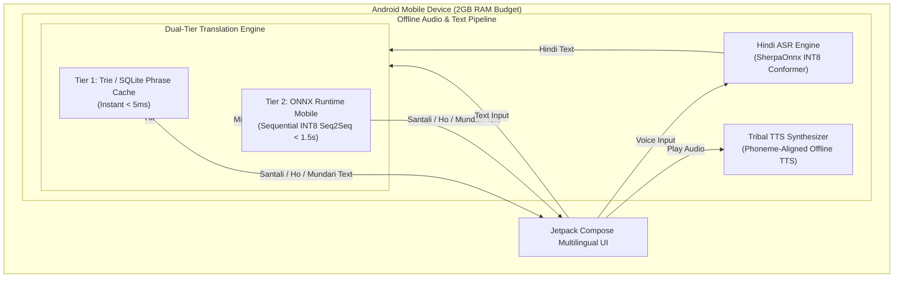
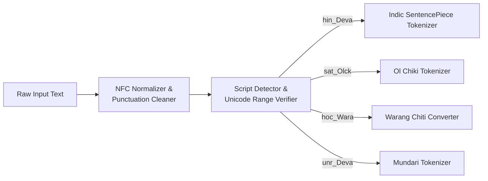

# Aadivaani — System Architecture Specification

**Document**: `docs/architecture.md`  
**Version**: 1.0 (Phase 0 Deliverable)  
**System**: Aadivaani Offline Multilingual Translation Platform  

---

## 1. High-Level Architecture Overview

Aadivaani is designed as an **edge-first, 100% offline translation system** targeting low-resource tribal languages (Santali, Ho, Mundari) and Hindi on low-end Android hardware (2GB RAM, quad-core ARM CPU).



---

## 2. Model Architecture & Deployment Strategy

### 2.1 The Teacher vs. Edge Model Decision
| Consideration | IndicTrans2 1B (`indic-indic-1B`) | IndicTrans2 200M Distilled (`indic-indic-dist-200M`) | Custom Pruned Tiny-Seq2Seq (50M–100M) |
| :--- | :--- | :--- | :--- |
| **Parameters** | 1.05 Billion | 204 Million | 60–100 Million |
| **Weight Size (FP16)** | ~2,100 MB | ~410 MB | ~120–200 MB |
| **Weight Size (INT8)** | ~1,050 MB | ~310 MB (Enc: 115M, Dec: 195M) | ~60–100 MB |
| **RAM Footprint (Inference)**| > 4.5 GB | ~350–450 MB (Sequential) | ~150–250 MB |
| **Feasibility on 2GB RAM** | **IMPOSSIBLE** (OS Kills Process) | **FEASIBLE** (Strict Session Unload) | **OPTIMAL** |
| **Role in Aadivaani** | **Server-side Teacher Model** | **Primary Edge Deployable Target** | **Future Ultra-Low-Power Edge** |

### 2.2 Dual-Tier Inference Engine (Why Dual-Tier is Essential)
Running autoregressive decoding on a 200M model on an entry-level ARM CPU (e.g., Cortex-A53 cores in 2GB phones) takes approximately 30–60ms per generated token. A 20-token translation requires 600ms–1200ms.
To guarantee instant response and reduce battery drain:
1. **Tier 1 (Trie / SQLite Phrase Cache)**:
   - Stores 15,000+ verified conversational pairs (greetings, governance, medical instructions, questions).
   - Lookup time: **< 5 ms**, RAM consumption: **< 15 MB**.
   - Zero CPU thermal throttling.
2. **Tier 2 (Sequential ONNX Runtime Mobile INT8)**:
   - Invoked only on cache misses for arbitrary complex sentences.
   - Executes with 4 threads on ARM big.LITTLE cores.
   - Enforces sequential execution:
     - Load Encoder session $\rightarrow$ Run Encoder $\rightarrow$ Close & free Encoder session.
     - Load Decoder session with KV-cache $\rightarrow$ Run greedy decode $\rightarrow$ Close & free Decoder session.
   - Peak RAM: strictly under **400 MB**.

---

## 3. Script Validation & Transliteration Layer

Tribal languages in the Jharkhand/Odisha/West Bengal region utilize distinct writing systems and dialects:
1. **Santali (`sat`)**:
   - Primary Script: **Ol Chiki** (`U+1C50`–`U+1C7F`).
   - Official ISO code: `sat_Olck`.
   - Script integrity validator ensures 0% foreign character contamination.
2. **Ho (`hoc`)**:
   - Primary Traditional Script: **Warang Chiti** (`U+118A0`–`U+118FF`).
   - Common Regional Script: Devanagari (`hoc_Deva`) and Latin (`hoc_Latn`).
   - Dual-script support: Internal normalization to canonical phonemes, with rendering selectable by the user.
3. **Mundari (`unr`)**:
   - Primary Regional Script: Devanagari (`unr_Deva`), Mundari Bani, and Latin.
   - Standardized phoneme dictionary for Munda-Hindi roots.



---

## 4. Voice Processing Pipeline (ASR & TTS)

### 4.1 Hindi Speech Recognition (ASR)
- **Model**: `meetsync/indic-conformer-onnx-sherpa` (INT8 quantized).
- **Engine**: SherpaOnnx offline runtime (C++ native core via JNI).
- **Footprint**: ~188 MB on disk, ~120 MB RAM during active listening.
- **Latency**: Real-time factor (RTF) < 0.3 on ARMv8.

### 4.2 Tribal Text-to-Speech (TTS)
- **Problem in Existing Repo**: Built-in Android TTS does not support Ol Chiki or Warang Chiti, producing unintelligible sounds via English/Hindi transliteration.
- **Aadivaani Solution**:
  - **Phase 3 Prototype**: Phoneme-concatenative or formant synthesis for verified tribal syllables.
  - **Phase 5 Production**: Compact VITS / FastSpeech2 / Piper TTS INT8 model (~25–35 MB) trained on recorded native tribal voice datasets.

---

## 5. Security, Memory Budget & Performance Benchmarks

### 5.1 Memory Budget Breakdown (2GB Total Device RAM)
```
Total Device RAM: 2048 MB
├── Android System & Background Services : ~1000 - 1200 MB
├── Available Heap Space for App         : ~450 - 550 MB
└── Aadivaani Application Footprint (Target < 400 MB)
    ├── Android UI & Compose Runtime     : ~60 MB
    ├── Phrase Cache (In-Memory Trie)    : ~15 MB
    ├── ONNX Runtime Overhead            : ~45 MB
    └── Model Weights Working Memory      : ~250 MB
        ├── Encoder Peak (Int8)          : ~180 MB
        └── Decoder Peak (Int8 + KV)     : ~260 MB (Alternating)
```

### 5.2 Performance Targets
- **Cache Hit Latency**: $< 10\text{ ms}$
- **Neural Translation Latency (15 tokens)**: $< 1.8\text{ s}$ on 4-thread ARM CPU
- **Ol Chiki Script Accuracy**: $100.0\%$ (Zero foreign leakage)
- **Cold Boot Time**: $< 1.2\text{ s}$
- **Zero Internet Permissions** declared in `AndroidManifest.xml` for production offline build.
