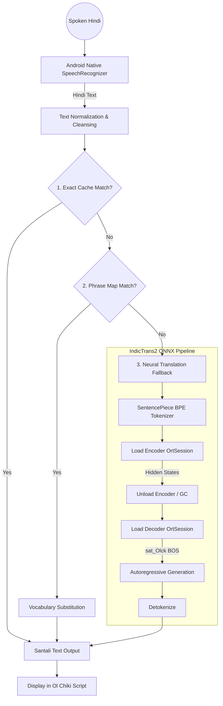

# Hindi-Santali Offline Voice Translator — Architecture & Design

This document outlines the system architecture, design decisions, and technical implementation of the offline Hindi-to-Santali voice translation application.

## 1. High-Level System Overview

The application is a fully offline, on-device Android application designed to bridge the communication gap for Santali speakers. It operates within strict hardware constraints (target: 2GB RAM devices, <100MB application size) to ensure accessibility in rural areas with poor connectivity.

The core pipeline consists of three stages:
1. **Automatic Speech Recognition (ASR):** Converts spoken Hindi into text.
2. **Translation Engine:** A hybrid cache-and-neural translation system converting Hindi text to Santali (Ol Chiki script).
3. **Text-to-Speech (TTS):** (Upcoming) Synthesizes the Santali text back into audio.

---

## 2. System Architecture

The architecture is designed to minimize latency and memory footprint by prioritizing fast, deterministic lookups before falling back to computationally expensive neural network inference.

---

## 3. Component Design & Technical Specifications

### 3.1 Speech Recognition (ASR)
*   **Technology:** Android Native `SpeechRecognizer` API.
*   **Configuration:** `hi-IN` locale, offline mode.
*   **Rationale:** Initial tests with custom models (e.g., IndicConformer 200M) yielded 10-11s latency on budget devices. Utilizing the OS-level ASR leverages the device DSP/NPU hardware acceleration, dropping latency to <600ms with zero battery drain.

### 3.2 The Three-Level Translation Engine
To ensure real-time performance on low-end hardware, the translation step is tiered:

1.  **Level 1: Offline Phrase Cache (O(1) lookup)**
    *   **Mechanism:** An embedded JSON dictionary of ~4,000 highly accurate training pairs.
    *   **Process:** Input is stripped of punctuation and matched exactly.
    *   **Latency:** < 5ms.
2.  **Level 2: Phrase & Vocabulary Substitution**
    *   **Mechanism:** Curated maps of common verbs and their conjugations combined with a vocabulary dictionary.
    *   **Process:** Substitutes known grammatical structures and translates remaining words.
    *   **Latency:** < 10ms.
3.  **Level 3: Neural Model Inference (IndicTrans2)**
    *   **Mechanism:** Sequence-to-sequence Transformer model handling entirely novel sentences.
    *   **Latency:** 2-8 seconds depending on sequence length and device SoC.

### 3.3 Neural Translation Pipeline (IndicTrans2)
The fallback neural translation uses an adapted version of IndicTrans2 (a multilingual model trained on the Bharat Parallel Corpus).

*   **Direction:** `hin_Deva` (Hindi/Devanagari) to `sat_Olck` (Santali/Ol Chiki).
*   **Fine-Tuning:** The base 200M parameter model was fine-tuned using **LoRA (Low-Rank Adaptation)** on a dataset of ~4,000 parallel sentences (sourced from FLORES-200 and synthetic domain-specific augmentation). LoRA allowed for highly efficient domain adaptation by updating only ~1-2% of the parameters.
*   **Quantization:** The float32 model was over 1.2GB. It was exported to ONNX format and subjected to **dynamic per-channel INT8 quantization**.
    *   Encoder: 479MB to 115MB
    *   Decoder: 807MB to 194MB
    *   Total Size: ~309MB (75% compression).

### 3.4 Memory Management Strategy (Sequential Loading)
Android devices with 2GB RAM typically only expose a small fraction to the JVM/native heap. Loading both the Encoder and Decoder simultaneously causes Out-Of-Memory (OOM) crashes.

**Solution:** Explicit sequential lifecycle management via ONNX Runtime `OrtSession`.
1.  Initialize Encoder `OrtSession`.
2.  Run forward pass to generate contextual embeddings.
3.  Explicitly call `.close()` on the Encoder session and trigger Garbage Collection.
4.  Initialize Decoder `OrtSession`.
5.  Generate output tokens autoregressively.
6.  Close Decoder.

This restricts the peak memory footprint to **~200MB** at any given time.

---

## 4. Data & Linguistic Challenges

*   **Data Scarcity:** Santali is a severely low-resource language. Training relied on the limited FLORES-200 dataset augmented with generated pairs.
*   **Grammatical Mismatch:** Template-generated training data initially suffered from incorrect Hindi verb conjugations. This was mitigated by intercepting incorrect conjugations in the Level 2 Phrase Map.
*   **Script Support:** Santali utilizes the Ol Chiki script. The app relies on native Unicode rendering (supported since Unicode 5.1) rather than custom font files, ensuring compatibility across devices.

## 5. Future Roadmap
1.  **Text-to-Speech (TTS) Integration:** Implementing Meta MMS-TTS (Massively Multilingual Speech) VITS-based model to provide audio output for the translated Santali text.
2.  **Transliteration Fallback:** Implementing an Out-Of-Vocabulary (OOV) phonetic transliteration layer to handle modern loanwords (e.g., "computer", "mobile") by scripting them directly into Ol Chiki.
3.  **Data Expansion:** Sourcing higher-quality parallel data from regional government documents to reduce reliance on the phrase map and improve the neural model generalization.
